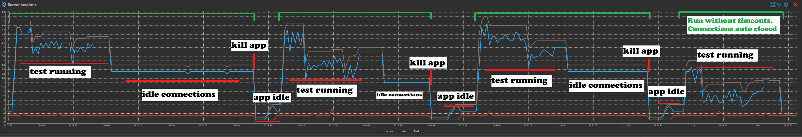
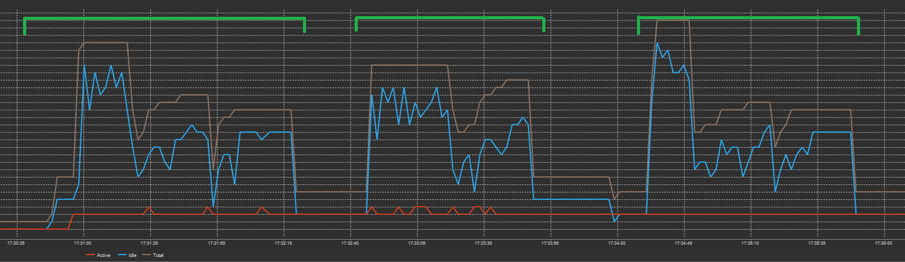

Demo repo to reproduce potential problem when database connections remain idle when http request is cancelled.
Can be reproduced with marten v8.33, but is working compeletely fine with latest v9.5

## How to reproduce
- start docker compose with postgres
- run dotnet project
- install k6 if not present
- run k6 test: `k6 run k6.js`

## Explanation
In connection string i've explicitly defined `Connection Idle Lifetime=30; Connection Pruning Interval=10;`, so after 30 seconds all idle connections should definetely be released.
The endpoint has a random delay (50-600ms) and a call in a test has a 500ms timeout.
Here is the connection dashboard for the situation after 4 test runs:

After test has finished (run 1-3) there are still idle connections that are not released.
In run 4 i've increased timeout in k6 test, so all requests are done to complition - all connections are released immediately.

If you update marten to latest v9.5, the problem seems to dissapear.
Here is the connection dashboard for 3 runs (without killing the app):

